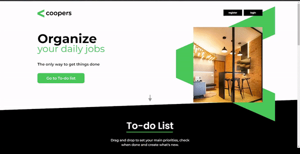

<br />
<div align="center">

<h1 align="center">Teste Coopers</h1>

  <a href="https://guiwustro-teste-coopers.vercel.app/">
Link do projeto</a>
</div>

## Sobre o projeto

No geral, não tive grandes dificuldades no desenvolvimento do projeto, pois
desenvolvi utilizando uma tecnologia que já estou habituado. A parte mais
desafiadora do projeto, foi o drag and drop da lista de tarefas, tanto o
back-end quanto o front-end.

Para desenvolver essa funcionalidade, no front-end utilizei a biblioteca
react-dnd, em que tive o contato com ela pela primeira vez, seguindo a
documentação da mesma consegui desenvolver a funcionalidad. No back-end, para
persistir esse posicionamento, foi um desafio de lógica, pois a alteração da
posição de uma tarefa, acaba alterando a posição de outras tarefa, portanto,
todas as alteradas deviam ter suas posições alteradas em uma posição, tanto para
cima ou para baixo, dependendo do caso. Por exemplo, se a tarefa do index 1
fosse para o index 5, as tarefas entre 1 e 5 teriam suas posições alteradas no
banco de dados.

Já para funcionalidade de edição do nome da tarefa, também me desafiei um pouco,
ao invés de fazer o tradicional modal no centro da tela, como costumo fazer,
resolvi fazer com que esse modal tivesse a posição exata da tarefa que está
sendo editada.

Sobre a organização do projeto, primeiramente desenvolvi a API com um CRUD de
tasks, juntamente com usuários, criando alguns testes E2E utilizando a
biblioteca Jest para validar minhas rotas. Na sequência, fiz a separação do
desenvolvimento do front por componentes, como Header, Carrossel, Card para as
Tasks, entre outros, e por fim, fiz alguns ajustes no back-end, adicionando a
funcionalidade que persistisse a mudança da ordem de posição das tarefas.

Por fim, para melhorar a performance da aplicação com relação a resposta ao
usuário na parte do To-tolist, ao invés de atualizar o estado apenas depois da
confirmação da API, foi feito a mudança do estado antes, e no caso da requisição
falhar, o estado volta para o estado original, notificando o usuário um erro que
não foi possível fazer a atualização. Apenas na criação é colocado um toast de
carregamento.

A organização das pastas do projeto foi estruturado da seguinte forma:

```
    ├── src
    │   ├── api             # Instancia da API
    │   ├── assets          # Imagens
    │   ├── components      # Componentes da aplicação
    │   ├── contexts        # Gerenciamento dos estados globais
    │   ├── routes          # Organização das rotas
    │   ├── styles          # Reset CSS Global
    │   ├── fonts           # Fontes da aplicação
    │   └── pages           # Páginas da aplicação
```

## Tecnologias utilizadas

O projeto foi realizado em React e as principais bibliotecas utilizadas foram:

- axios;
- styled components;
- react-dnd;
- react-hot-toast;
- react-hook-form;

## Usabilidade
<div align="center">

</div>
## Como iniciar o projeto

Para iniciar o projeto, siga os comandos abaixo, lembrando que é necessário ter
NodeJS instalado na máquina. O utilizado para inicialização foi a versão 18.15.0

```
yarn install
```

```
yarn dev
```

## Features implementadas

- [x] Registro de usuário ;
- [x] Login (autenticação) do usuário, listando suas tarefas;
- [x] Adição de novas tarefas;
- [x] Remoção de tarefas;
- [x] Remoção de todas as tarefas de um tipo;
- [x] Edição do nome da tarefa;
- [x] Mudança de ordem das tarefas através de drag-n-drop;
- [x] Responsivo para todas as telas;
